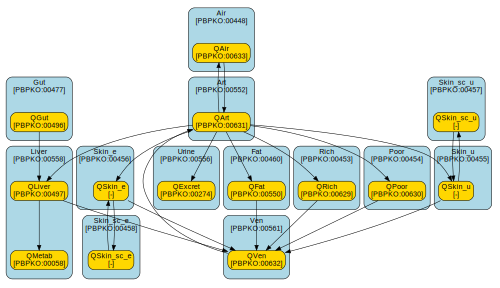

---
hide:
  - navigation
---

# Example

To illustrate the practical application of the FAIR PBK standard, the EuroMix generic PBK model from [Tebby et al. (2020)](https://doi.org/10.1016/j.fct.2020.111440) was re-implemented in compliance with the standard. A brief description of this re-implementation is provided below. The full model code is available on [GitHub](https://github.com/rivm-syso/euromix-to-sbml).

## Re-implementation in Antimony

To translate the model to Antimony, the differential equations were manually converted to transfer equations as used in Antimony. The names of the model elements were kept consistent with the original implementation wherever possible, facilitating comparison between the original MCSim model and the Antimony re-implementation.

The 13 states of the MCSim model were mapped to chemical species in the Antimony, which were arranged into 12 compartments, with the liver compartment containing two species (modelling the amount of the chemical and the amount metabolized in the liver). Internal model parameters/variables tracking the compartment volumes were mapped to the compartments themselves, which represent physical volumes in Antimony/SBML. Also the parameters and internal assignments were translated, as much as possible, in a one-to-one manner to parameters in the Antimony re-implementation. However, in order to comply with criterion G01 of the standard, all hardcoded dosing parameters of the original implementation were excluded from the model.

The converted Antimony model file can be found [here](https://github.com/rivm-syso/euromix-to-sbml/blob/main/model/euromix.ant).

## SBML conversion and model annotation

Conversion of the Antimony model implementation to an SBML file is done automatically using native functionality of [libAntimony](https://github.com/sys-bio/antimony/). Although the Antimony language supports specifying units and annotations directly within the model code, these have been omitted from the Antimony re-implementation to enhance readability of the model code. Therefore, the converted SBML file does not yet include proper annotations.

All annotations are provided in a separate [CSV file](https://github.com/rivm-syso/euromix-to-sbml/blob/main/model/euromix.annotations.csv), which links model elements to ontological terms and specifies their units of measure. The converted SBML file is annotated using the small (experimental) python package [sbmlpbkutils](https://github.com/jwkruisselbrink/sbml-pbk-utils) using the annotations specified by CSV file.

The annotated, and FAIR PBK compliant SBML file can be found [here](https://github.com/rivm-syso/euromix-to-sbml/blob/main/model/euromix.sbml).

## Open source development and archived releases

The full model code is publicly available and maintained on [GitHub](https://github.com/rivm-syso/euromix-to-sbml). However, the FAIR digital resources are specific versioned releases of the annotated SBML file that are published and permanently archived on Zenodo.

TODO: publish v1.0.0

## Model info

To demonstrate the power and completeness of the annotation standard, find below the general model info, and information on the compartments, (chemical) species, and parameters that can be extracted from the model.

### General



### Compartments



### Species



### Parameters


