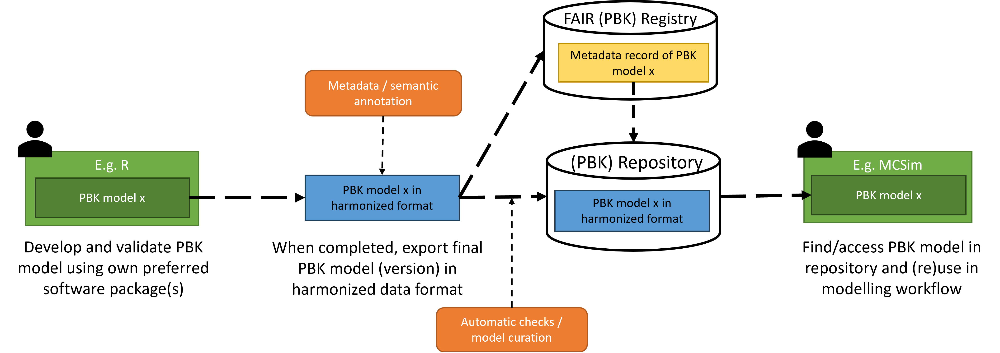

---
hide:
  - navigation
---

# FAIR PBK Standard

Physiologically Based Kinetic (PBK) models are models for simulating the absorption, distribution, metabolism, and excretion of chemicals in living systems. To maximize their impact, PBK models should not only be scientifically sound but also FAIR — Findable, Accessible, Interoperable, and Reusable. The **FAIR PBK standard** provides **a structured set of rules for publishing PBK models**. By following this standard standard, PBK model developers ensure their model code is transparent, reproducible, and reusable for future applications.

## Guiding principle

A foundational aspect of the FAIR PBK standard is the recognition that PBK model developers use, and will continue to use, diverse tools and languages to implement models. This raises the question of how models can be exchanged and understood across different developers and platforms. The FAIR PBK standard addresses this challenge by providing a harmonized exchange format for sharing and publishing PBK models. It is not intended to replace existing development practices, but rather to offer a consistent framework for publishing models, making them easier for other developers to find, interpret, and reuse.

The figure below illustrates the workflow for PBK model developers and model users. PBK model developers, on the left side of the figure, develop models using the modelling software/language of their own preference. When publishing (versions of) developed PBK models, the modellers can convert their model to an annotated FAIR PBK model to make it interoperable and reusable, and publish it on a repository to make it findable and accessible. Model (re)users can, on the right side of the figure, can find and access models via the repositories, and import and use the interoperable and reusable format within their own environment.

## At a glance

To achieve a high level of interoperability and reusability, key elements of the FAIR PBK standard are the use of the [Systems Biology Markup Language (SBML)](https://sbml.org/) as harmonized, technical exchange format, complemented with specific rules for annotation of units and model elements. For specification of the model units and its RDF-based annotation system—utilizing MIRIAM standards—is employed to annotate model elements. However, for the latter specific rules are provided on what to annotate and what ontologies to use. That is, all model elements should be annotated (or labelled with) specific terms from the [PBPKO ontology](https://insilicovida-research-lab.github.io/pbpko/), the chemical applicability domain and the chemical identifiers of chemical-specific model elements shoud be annotated using the [ChEBI ontology](https://www.ebi.ac.uk/chebi), and the modelled (animal) species should be specified using the [NCBI Taxonomy](https://www.ncbi.nlm.nih.gov/taxonomy). For the complete set of rules specifying the FAIR PBK standard, see the [full specification](specification.md)

## Scope

### A standard for model definitions

The FAIR standard applies to PBK model definitions — the structural representations of the models. It does not cover specific parametrisations (i.e., specific values for parameters like physiological parameters and partition coefficients) and dosing scenarios. Because of this, PBK models following the standard are flexible and reusable across diverse dosing and parametrisation scenarios.

### Part of FAIR

The FAIR PBK standard itself is not a complete specification for all aspects of FAIR — focusing mainly on interoperability and reusability. However, it can be included as part of a broader FAIR specification, or FAIR implementation profile (see [use in FIP](use_in_FIP.md)).
