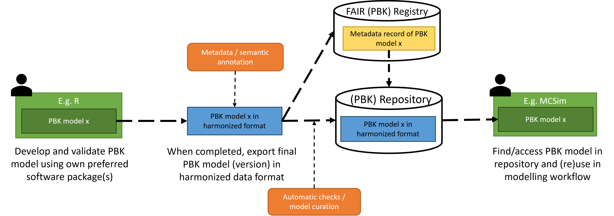

---
hide:
  - navigation
---

# FAIR PBK Standard

The FAIR PBK standard is an open exchange standard for representing physiologically based kinetic (PBK) models. It promotes **interoperability** and **reusability** by providing a harmonized format for sharing models consistently across software platforms, modeling environments, and application domains.

## Harmonized exchange format

The standard prescribes the use of [Systems Biology Markup Language (SBML)](https://sbml.org/) as the core exchange format, combined with specific rules for model implementation, unit specification, and semantic annotation. For the complete set rules and guidelines, see the [specification](specification.md).

## Built on established resources

- **[SBML](https://sbml.org/)**: Core markup language for biological models
- **[PBPKO Ontology](https://insilicovida-research-lab.github.io/pbpko/)**: Domain-specific annotations for PBK model elements
- **[ChEBI](https://www.ebi.ac.uk/chebi)**: Chemical identifiers and ontology
- **[NCBI Taxonomy](https://www.ncbi.nlm.nih.gov/taxonomy)**: Species classification

## A standard for model implementations

The standard applies to **PBK model implementations**, being the structural representations of models. It does **not** cover specific parameter values (e.g. of physiological parameters, partition coefficients) and dosing scenarios. This design ensures models remain **flexible and reusable** across different contexts.

## FAIR aligned workflow

The standard recognizes that PBK model developers use diverse tools and languages. Rather than replacing existing practices, it provides a **consistent framework** for publishing models, making them easier to find, interpret, and reuse.

The standard is designed to support the workflow presented below, enabling a connection between model developers and users:

- **Model developers** create models using their preferred software, then convert to annotated FAIR PBK standard for publication.

- **Model users** discover interoperable models through repositories and integrate them into their own environments.

While focusing on **interoperability and reusability**, the FAIR PBK standard complements broader [FAIR principles](https://www.go-fair.org/fair-principles/). It can be integrated into comprehensive FAIR specifications or implementation profiles (see [Use in FIP](fip.md)).

## Get Started

- **[Full specification](specification.md)**: Complete rules and guidelines
- **[Use in FIP](fip.md)**: Illustration of the use of the standard in a FAIR implementation profile (FIP)
- **[Resources](resources.md)**: Tools, examples, and references
- **[About](about.md)**: Background and contributors
